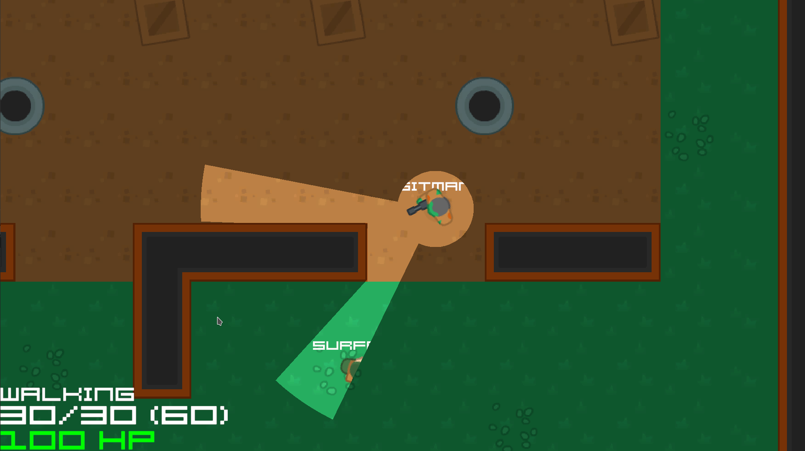
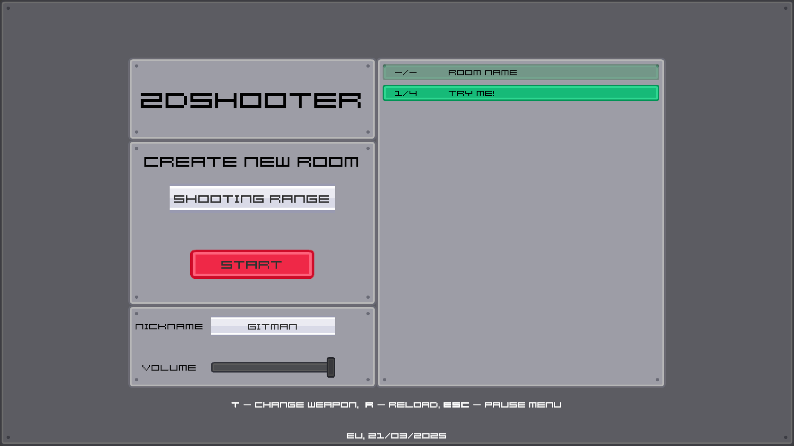

# 2dShooter - try this game [here!](https://gitmanik.dev/2ds)

## Description

This is a simple 2D shooter game I made a couple years ago and finally decided to polish and publish. I was probably inspired by Among Us and it's limited view.
Game has a powerup spawn system which can give you Health Boost or Ammo Pack.

### Controls
  - **T**: Change weapon
  - **ESC**: Pause menu
  - **R**: Reload
  - **CTRL**: Toggle sprint

### Technology Stack
- **Game Engine:** Unity 6 (6000.0.38f1)
- **Networking:** - Photon Unity Networking 2
- **Graphics:** 
  - [Kenney Fonts](https://kenney.nl/assets/kenney-fonts)
  - [Kenney UI Pack - Sci-Fi](https://kenney.nl/assets/ui-pack-sci-fi)
  - [Kenney Top Down Shooter](https://kenney.nl/assets/top-down-shooter)
- **Audio:**
  - [Kenney Impact Sounds](https://kenney.nl/assets/impact-sounds)
  - 4crain@gmail.com
- [Better Minimal WebGL Template](https://seansleblanc.itch.io/better-minimal-webgl-template)
